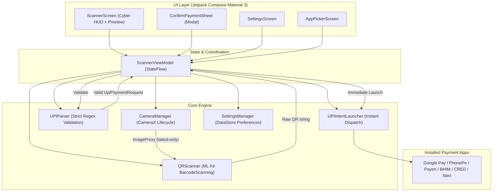

<div align="center">


# PayDart

**Lightweight, Lightning-Fast UPI QR Launcher for Android**

[](LICENSE)
[](https://ajaymyth.github.io/PayDart)
[-brightgreen.svg)](https://developer.android.com)
[](https://kotlinlang.org)
[](https://developer.android.com/training/camerax)
[](https://developers.google.com/ml-kit)
[](https://developer.android.com/jetpack/compose)

Point at any UPI QR code or upload a screenshot, and **PayDart** instantly hands off payment details to your favorite UPI app (Google Pay, PhonePe, Paytm, BHIM, CRED, Navi) in **under 10 milliseconds**. Zero lag. Zero bloat. Zero cloud.

[🌐 Official Website](https://ajaymyth.github.io/PayDart) • [📥 Download APK](https://ajaymyth.github.io/PayDart/#download) • [Features](#features) • [Performance](#performance-engineering) • [Architecture](#architecture) • [Getting Started](#getting-started) • [Contributing](#contributing)

</div>

---

## ⚡ The Problem & The Solution

Default camera apps and full-featured scanner apps are heavy. They perform multi-format barcode detection, cloud OCR lookups, high-res frame capture, and run bloated home screens. On low- and mid-range devices, opening stock scanners causes visible stutter, overheating, and 3–5 seconds of lag just to read a shop counter QR.

**PayDart is engineered for one thing only: Maximum Speed.**
It detects only QR codes, validates the UPI payment format on-device, and snaps straight into your target UPI app without showing intermediate dialogs or wasting CPU cycles.

---

## 🚀 Features

- **⚡ Lightning-Fast Redirection:** Snaps straight into your UPI app in `< 10ms` with zero-lag window transitions (`overridePendingTransition(0, 0)`).
- **🎯 Precision Cyber HUD Reticle:** High-tech Electric Cyan targeting reticle with center crosshairs and animated neon laser sweep.
- **🖼️ QR Image / Screenshot Upload:** Upload UPI QR codes directly from your gallery using Android's modern Photo Picker (requires **zero storage permissions**).
- **🚀 Smart UPI Handoff:**
  - Auto-detects single installed UPI apps (e.g. PhonePe or Google Pay) and targets them directly with zero configuration.
  - Supports preferred app selection from Settings.
  - Clean fallback to Android's native system resolver when multiple apps are present.
- **🛡️ Strict Zero-Allocation UPI Validation:** Pure Kotlin URI validation verifying scheme (`upi://pay`), payee VPA (`pa`), amount (`am`), currency (`cu`), and note (`tn`). Rejects non-UPI and malicious links automatically.
- **📴 100% Offline & Private:** Zero network requests. Zero frame buffers. Zero telemetry. PayDart never touches your money, credentials, or scan history.
- **🔋 Battery & CPU Friendly:** Single-format detector (`Barcode.FORMAT_QR_CODE`) with `STRATEGY_KEEP_ONLY_LATEST`. Post-detection CPU usage drops immediately to idle.
- **📳 Haptic Confirmation:** Crisp, subtle tactile tick confirming successful QR detection.

---

## 🏎️ Performance Engineering

| Optimization | How It Works | Impact |
|---|---|---|
| **Background ML Kit Warmup** | Feeds an 8×8 dummy bitmap to ML Kit's native C++ engine (`libbarhopper_v3.so`) at startup. | Cuts first-frame detection delay from ~400ms down to **< 10ms**. |
| **Instant Window Snap** | Calls `context.overridePendingTransition(0, 0)` on activity launch. | Eliminates the OS's 250ms window exit animation lag. |
| **Zero-IPC Critical Path** | Bypasses `pm.getPackageInfo()` Binder IPC calls before `startActivity`. | Saves 20–50ms on every single scan. |
| **Bypassed `createChooser`** | Uses direct native intent resolution instead of heavy Android Chooser sheets. | Saves 300–800ms and eliminates an unnecessary extra tap. |
| **Atomic Frame Discard** | First valid frame flips `isPaused.compareAndSet(false, true)`. | Drops all in-flight camera frames in **0 µs** without CPU thrash. |
| **Resolution Strategy** | Configured `FALLBACK_RULE_CLOSEST_LOWER_THEN_HIGHER` for 720p/480p streams. | Keeps detector processing at **15–25ms** per frame, preventing 4K buffer bottlenecks. |

---

## 🏛️ Architecture

PayDart follows a clean, single-module **MVVM-lite** architecture designed for minimal footprint:



---

## 🛠️ Tech Stack

- **Language:** [Kotlin 2.0.21](https://kotlinlang.org/)
- **UI Toolkit:** [Jetpack Compose](https://developer.android.com/jetpack/compose) with Material 3 (BOM 2024.12.01)
- **Camera:** [AndroidX CameraX 1.4.1](https://developer.android.com/training/camerax) (Camera2 + Lifecycle + View)
- **Barcode Detection:** [Google ML Kit Barcode Scanning 17.3.0](https://developers.google.com/ml-kit/vision/barcode-scanning) (On-Device, QR-Only)
- **Preferences:** [Jetpack DataStore 1.1.1](https://developer.android.com/topic/libraries/architecture/datastore) (Preferences)
- **Asynchronous Flow:** Kotlin Coroutines 1.9.0 & StateFlow
- **Build System:** Gradle 8.11.1 with Kotlin DSL & Version Catalogs (`libs.versions.toml`)
- **Min SDK:** 24 (Android 7.0 Nougat) — covers >98% of active Android devices
- **Target SDK:** 35 (Android 15)

---

## 📦 Getting Started

### Prerequisites
- Android Studio Ladybug (2024.2+) or later
- JDK 17
- Android SDK with API 35 installed
- An Android device or emulator running Android 7.0 (API 24) or higher

### Clone the Repository
```bash
git clone https://github.com/AJAYMYTH/PayDart.git
cd PayDart
```

### Build & Run Unit Tests
```bash
./gradlew testDebugUnitTest
```

### Build Debug APK
```bash
./gradlew assembleDebug
```
The output APK will be generated at:
`app/build/outputs/apk/debug/app-debug.apk`

### Install onto Device via ADB
```bash
adb install -r app/build/outputs/apk/debug/app-debug.apk
```
Or directly using Gradle:
```bash
./gradlew installDebug
```

---

## 📁 Project Structure

```
PayDart/
├── .github/
│   └── workflows/
│       ├── ci.yml               # Automated test & build workflow on PR/push
│       └── release.yml          # Automated APK release pipeline on tag push
├── app/
│   ├── src/
│   │   ├── main/
│   │   │   ├── java/com/paydart/app/
│   │   │   │   ├── camera/      # CameraX manager, resolution selector, async controls
│   │   │   │   ├── scanner/     # ML Kit QR scanner with background warmup & UPI parser
│   │   │   │   ├── upi/         # Models, installed app registry, zero-IPC intent launcher
│   │   │   │   ├── settings/    # DataStore preferences & settings models
│   │   │   │   ├── ui/          # Compose screens, cyber HUD reticle, dock, dialogs
│   │   │   │   │   └── theme/   # Electric Cyber palette (Cyan, Obsidian, Mint, Violet)
│   │   │   │   ├── viewmodel/   # ScannerViewModel & state machine
│   │   │   │   └── MainActivity.kt
│   │   │   └── AndroidManifest.xml
│   │   └── test/                # Unit test suites (UPIParserTest, SettingsModelsTest)
│   └── build.gradle.kts
├── gradle/
│   └── libs.versions.toml       # Centralized Gradle version catalog
├── docs/                        # Architecture, PRD, and TRD design documents
├── CODE_OF_CONDUCT.md
├── CONTRIBUTING.md
├── LICENSE
├── README.md
└── SECURITY.md
```

---

## 🤝 Contributing

Contributions, bug reports, and feature proposals are welcome! Please read our [Contributing Guide](CONTRIBUTING.md) and [Code of Conduct](CODE_OF_CONDUCT.md) before submitting a pull request.

---

## 🔒 Security & Privacy

PayDart takes privacy seriously. It never accesses, stores, or transmits financial credentials, transaction histories, or camera images. For details or to report a vulnerability, please see our [Security Policy](SECURITY.md).

---

## 📄 License

PayDart is licensed under the [Apache License, Version 2.0](LICENSE).
Copyright © 2026 AJAYMYTH and PayDart Contributors.
